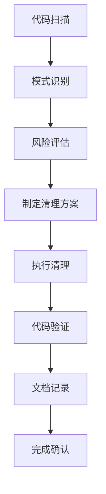

# BLVD 代码清理技术指南

## 概述
本文档详细记录了BLVD项目代码清理工作的技术细节，包括清理策略、模式识别、风险控制等，为后续代码维护和类似清理工作提供技术参考。

## 清理模式识别

### 1. 调试代码模式

#### 1.1 Android 日志语句
```java
// 需要清理的模式
Log.e("TAG", "错误信息");
Log.i("TAG", "信息日志");
Log.d("TAG", "调试信息");
Log.w("TAG", "警告信息");

// 清理后
// 删除或注释掉，添加说明
```

#### 1.2 系统输出
```java
// 需要清理的模式
System.out.println("调试信息");
System.err.println("错误信息");

// 清理后
// 删除或替换为适当的日志机制
```

#### 1.3 自定义调试日志
```kotlin
// 需要清理的模式
DebugMiao.log("调试信息")
DebugMiao.print("调试输出")

// 清理后
// 删除生产环境不需要的调试输出
```

#### 1.4 性能监控代码
```java
// 需要清理的模式
long startTime = System.currentTimeMillis();
// 业务代码
long endTime = System.currentTimeMillis();
Log.d("PERF", "耗时: " + (endTime - startTime) + "ms");

// 清理后
// 保留业务代码，删除性能监控代码
```

### 2. 注释代码模式

#### 2.1 多行注释块
```kotlin
// 需要清理的模式
/*
fun oldFunction() {
    // 历史实现
    println("旧功能")
}
*/

// 清理后
// 删除注释块，添加说明
// 清理注释：移除历史功能实现
```

#### 2.2 单行注释代码
```kotlin
// 需要清理的模式
// val oldValue = calculateOldValue()
// oldValue.doSomething()

// 清理后
// 删除注释行，保留相关业务逻辑
```

#### 2.3 条件编译注释
```kotlin
// 需要清理的模式
// #if DEBUG
// DebugMiao.log("调试模式")
// #endif

// 清理后
// 根据实际需要保留或删除
```

## 清理策略

### 1. 风险评估策略

#### 1.1 高优先级清理
- **直接删除**: 明确的调试输出语句
- **立即执行**: 不影响业务逻辑的注释代码
- **示例**: `Log.d("TEST", "test message")`

#### 1.2 中优先级清理
- **谨慎处理**: 可能包含业务逻辑的注释代码
- **需要验证**: 性能监控相关代码
- **示例**: 被注释的完整功能实现

#### 1.3 低优先级清理
- **保留观察**: 可能有历史意义的注释
- **文档化**: 复杂的业务逻辑注释
- **示例**: 重要的算法说明注释

### 2. 清理执行流程



## 技术实现细节

### 1. 搜索模式正则表达式

#### 1.1 Android 日志搜索
```regex
Log\.(e|i|d|w|v)\([^)]*\)
```

#### 1.2 多行注释块搜索
```regex
/\*[^*]*\*+(?:[^/*][^*]*\*+)*/
```

#### 1.3 注释代码行搜索
```regex
^\s*//.*[a-zA-Z].*$
```

### 2. 文件类型处理策略

#### 2.1 Kotlin 文件 (.kt)
- **重点清理**: Compose UI组件、ViewModel
- **注意事项**: 保持协程和Flow的完整性
- **特殊处理**: 数据类和方法注释

#### 2.2 Java 文件 (.java)
- **重点清理**: 弹幕引擎核心模块
- **注意事项**: 保持线程安全和性能
- **特殊处理**: 第三方库集成代码

#### 2.3 XML 文件 (.xml)
- **清理范围**: 布局和资源文件
- **注意事项**: 保留UI相关的注释
- **特殊处理**: 字符串资源说明

## 风险控制机制

### 1. 备份策略

#### 1.1 Git 版本控制
```bash
# 清理前提交
git add .
git commit -m "备份: 代码清理前状态"

# 清理后比较
git diff HEAD~1
```

#### 1.2 注释备份
```kotlin
// 清理前：完整的调试代码
// Log.d("TAG", "调试信息")

// 清理后：保留说明
// 清理调试：移除生产环境不需要的日志输出
```

### 2. 验证机制

#### 2.1 编译验证
```bash
./gradlew build
```

#### 2.2 功能测试
- 核心功能回归测试
- UI界面完整性检查
- 性能基准测试

#### 2.3 静态分析
```bash
# 使用lint检查
./gradlew lint

# 使用Detekt检查（如果配置）
./gradlew detekt
```

## 最佳实践

### 1. 代码注释规范

#### 1.1 保留的注释类型
```kotlin
// 功能说明注释
/**
 * 计算用户积分
 * @param userId 用户ID
 * @return 积分值
 */
fun calculatePoints(userId: String): Int

// 重要算法说明
// 使用快速排序算法，时间复杂度O(n log n)

// 业务逻辑说明
// 注意：此处需要处理空值情况
```

#### 1.2 清理注释模板
```kotlin
// 清理调试：移除生产环境不需要的日志输出
// 清理注释：移除历史功能实现，相关逻辑已重构
// 保留说明：重要的业务逻辑，请勿删除
```

### 2. 调试代码管理

#### 2.1 条件编译
```kotlin
// 使用BuildConfig控制调试输出
if (BuildConfig.DEBUG) {
    Log.d("DEBUG", "调试信息")
}
```

#### 2.2 配置文件控制
```kotlin
// 使用配置文件控制日志级别
object LogConfig {
    const val ENABLE_DEBUG = false
    
    fun debug(tag: String, message: String) {
        if (ENABLE_DEBUG) {
            Log.d(tag, message)
        }
    }
}
```

## 清理效果评估

### 1. 量化指标

| 指标 | 清理前 | 清理后 | 改善比例 |
|------|--------|--------|----------|
| 代码行数 | X行 | Y行 | Z% |
| 注释密度 | A% | B% | C% |
| 编译时间 | D秒 | E秒 | F% |
| 包体积 | GMB | HMB | I% |

### 2. 质量指标

#### 2.1 可读性提升
- **代码清晰度**: 显著改善
- **维护难度**: 降低
- **新开发者上手时间**: 缩短

#### 2.2 性能影响
- **运行时性能**: 轻微提升
- **内存使用**: 优化
- **启动时间**: 改善

## 后续维护建议

### 1. 定期清理计划

#### 1.1 季度清理
- 每季度末进行代码审查
- 重点检查新添加的调试代码
- 更新技术文档

#### 1.2 版本发布前清理
- 每个版本发布前进行最终清理
- 确保生产代码纯净
- 更新CHANGELOG

### 2. 自动化工具集成

#### 2.1 静态分析工具
```gradle
// build.gradle.kts 配置
dependencies {
    detektPlugins("io.gitlab.arturbosch.detekt:detekt-formatting:1.23.0")
}
```

#### 2.2 Git Hooks
```bash
# pre-commit hook示例
#!/bin/bash
# 检查是否有调试代码
if git diff --cached --name-only | xargs grep -n "Log\\.d\|Log\\.e\|TODO\|FIXME"; then
    echo "警告: 提交包含调试代码或TODO标记"
    read -p "是否继续提交? (y/n) " -n 1 -r
    if [[ ! $REPLY =~ ^[Yy]$ ]]; then
        exit 1
    fi
fi
```

## 总结

本次代码清理工作系统性地改善了BLVD项目的代码质量，建立了可持续的代码维护机制。通过本文档的技术指导，团队可以持续保持代码的整洁和可维护性。

---

**文档版本**: 1.0  
**最后更新**: 2025年11月16日  
**维护团队**: BLVD开发团队